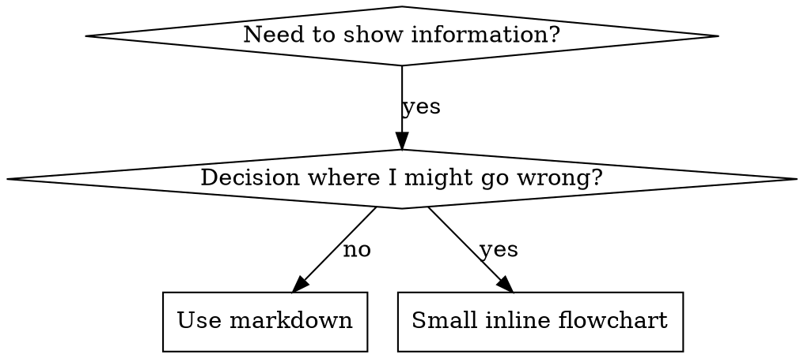

# Writing Skills

## Overview

Write reusable guidance and verify the claims it makes. Match verification to the risk of the change: material instruction changes need representative behavioral scenarios; editorial edits need focused text review and applicable syntax checks.

Select acceptance criteria and checks before editing. TDD-style baseline comparisons are useful for demonstrated behavioral failures, but are not mandatory for every skill edit. Load `test-driven-development` only when TDD is selected.

**Official guidance:** See anthropic-best-practices.md for Anthropic-specific authoring guidance. Model and harness behavior can differ; do not treat Claude-specific advice as a universal runtime contract.

## What is a Skill?

A **skill** is a reference guide for proven techniques, patterns, or tools. Skills help future Claude instances find and apply effective approaches.

**Skills are:** Reusable techniques, patterns, tools, reference guides

**Skills are NOT:** Narratives about how you solved a problem once

## TDD Mapping for Skills

| TDD Concept | Skill Creation |
|-------------|----------------|
| **Test case** | Pressure scenario with subagent |
| **Production code** | Skill document (SKILL.md) |
| **Test fails (RED)** | Agent violates rule without skill (baseline) |
| **Test passes (GREEN)** | Agent complies with skill present |
| **Refactor** | Close loopholes while maintaining compliance |
| **Write test first** | Run baseline scenario BEFORE writing skill |
| **Watch it fail** | Document exact rationalizations agent uses |
| **Minimal code** | Write skill addressing those specific violations |
| **Watch it pass** | Verify agent now complies |
| **Refactor cycle** | Find new rationalizations → plug → re-verify |

Use this mapping when TDD-style behavioral evaluation is selected.

## When to Create a Skill

**Create when:**
- Technique wasn't intuitively obvious to you
- You'd reference this again across projects
- Pattern applies broadly (not project-specific)
- Others would benefit

**Don't create for:**
- One-off solutions
- Standard practices well-documented elsewhere
- Project-specific conventions (put in AGENTS.md)
- Mechanical constraints (if it's enforceable with regex/validation, automate it—save documentation for judgment calls)

## Skill Types

### Technique
Concrete method with steps to follow (condition-based-waiting, root-cause-tracing)

### Pattern
Way of thinking about problems (flatten-with-flags, test-invariants)

### Reference
API docs, syntax guides, tool documentation (office docs)

## Directory Structure


```
skills/
  skill-name/
    SKILL.md              # Main reference (required)
    supporting-file.*     # Only if needed
```

**Flat namespace** - all skills in one searchable namespace

**Separate files for:**
1. **Heavy reference** (100+ lines) - API docs, comprehensive syntax
2. **Reusable tools** - Scripts, utilities, templates

**Keep inline:**
- Principles and concepts
- Code patterns (< 50 lines)
- Everything else

## SKILL.md Structure

**Frontmatter (YAML):**
- Use `name` and `description` for this guide's minimal template; confirm supported fields and size limits with the target package or harness validator
- Keep frontmatter concise
- `name`: Use letters, numbers, and hyphens only (no parentheses, special chars)
- `description`: Third-person, describes ONLY when to use (NOT what it does)
  - Start with "Use when..." to focus on triggering conditions
  - Include specific symptoms, situations, and contexts
  - **NEVER summarize the skill's process or workflow** (see CSO section for why)
  - Keep under 500 characters if possible

```markdown
---
name: Skill-Name-With-Hyphens
description: Use when [specific triggering conditions and symptoms]
---

# Skill Name

## Overview
What is this? Core principle in 1-2 sentences.

## When to Use
[Small inline flowchart IF decision non-obvious]

Bullet list with SYMPTOMS and use cases
When NOT to use

## Core Pattern (for techniques/patterns)
Before/after code comparison

## Quick Reference
Table or bullets for scanning common operations

## Implementation
Inline code for simple patterns
Link to file for heavy reference or reusable tools

## Common Mistakes
What goes wrong + fixes

## Real-World Impact (optional)
Concrete results
```


## Claude Search Optimization (CSO)

**Critical for discovery:** Future Claude needs to FIND your skill

### 1. Rich Description Field

**Purpose:** Claude reads description to decide which skills to load for a given task. Make it answer: "Should I read this skill right now?"

**Format:** Start with "Use when..." to focus on triggering conditions

**CRITICAL: Description = When to Use, NOT What the Skill Does**

The description should ONLY describe triggering conditions. Do NOT summarize the skill's process or workflow in the description.

Keep triggers in the description and detailed procedure in the body so discovery text does not present an incomplete procedure. Whether a model reads and follows the body depends on the model and harness; verify that behavior when it matters. This guide does not establish a universal Claude discovery mechanism.

```yaml
# ❌ BAD: Summarizes workflow - Claude may follow this instead of reading skill
description: Use when executing plans - dispatches subagent per task with code review between tasks

# ❌ BAD: Too much process detail
description: Use for TDD - write test first, watch it fail, write minimal code, refactor

# ✅ GOOD: Just triggering conditions, no workflow summary
description: Use when executing implementation plans with independent tasks in the current session

# ✅ GOOD: Triggering conditions only
description: Use when implementing any feature or bugfix, before writing implementation code
```

**Content:**
- Use concrete triggers, symptoms, and situations that signal this skill applies
- Describe the *problem* (race conditions, inconsistent behavior) not *language-specific symptoms* (setTimeout, sleep)
- Keep triggers technology-agnostic unless the skill itself is technology-specific
- If skill is technology-specific, make that explicit in the trigger
- Write in third person; how descriptions enter context depends on the harness
- **NEVER summarize the skill's process or workflow**

```yaml
# ❌ BAD: Too abstract, vague, doesn't include when to use
description: For async testing

# ❌ BAD: First person
description: I can help you with async tests when they're flaky

# ❌ BAD: Mentions technology but skill isn't specific to it
description: Use when tests use setTimeout/sleep and are flaky

# ✅ GOOD: Starts with "Use when", describes problem, no workflow
description: Use when tests have race conditions, timing dependencies, or pass/fail inconsistently

# ✅ GOOD: Technology-specific skill with explicit trigger
description: Use when using React Router and handling authentication redirects
```

### 2. Keyword Coverage

Use words Claude would search for:
- Error messages: "Hook timed out", "ENOTEMPTY", "race condition"
- Symptoms: "flaky", "hanging", "zombie", "pollution"
- Synonyms: "timeout/hang/freeze", "cleanup/teardown/afterEach"
- Tools: Actual commands, library names, file types

### 3. Descriptive Naming

**Use active voice, verb-first:**
- ✅ `creating-skills` not `skill-creation`
- ✅ `condition-based-waiting` not `async-test-helpers`

### 4. Token Efficiency (Critical)

Frequently loaded skills consume context repeatedly. Keep them focused; loading behavior depends on the harness.

**Target word counts:**
- getting-started workflows: <150 words each
- Frequently-loaded skills: <200 words total
- Other skills: <500 words (still be concise)

**Techniques:**

**Move details to tool help:**
```bash
# ❌ BAD: Document all flags in SKILL.md
search-conversations supports --text, --both, --after DATE, --before DATE, --limit N

# ✅ GOOD: Reference --help
search-conversations supports multiple modes and filters. Run --help for details.
```

**Use cross-references:**
```markdown
# ❌ BAD: Repeat workflow details
When searching, dispatch subagent with template...
[20 lines of repeated instructions]

# ✅ GOOD: Reference other skill
Use [other-skill-name] for the applicable workflow.
```

**Compress examples:**
```markdown
# ❌ BAD: Verbose example (42 words)
your human partner: "How did we handle authentication errors in React Router before?"
You: I'll search past conversations for React Router authentication patterns.
[Dispatch subagent with search query: "React Router authentication error handling 401"]

# ✅ GOOD: Minimal example (20 words)
Partner: "How did we handle auth errors in React Router?"
You: Searching...
[Dispatch subagent → synthesis]
```

**Eliminate redundancy:**
- Don't repeat what's in cross-referenced skills
- Don't explain what's obvious from command
- Don't include multiple examples of same pattern

**Verification:**
```bash
wc -w skills/path/SKILL.md
# getting-started workflows: aim for <150 each
# Other frequently-loaded: aim for <200 total
```

**Name by what you DO or core insight:**
- ✅ `condition-based-waiting` > `async-test-helpers`
- ✅ `using-skills` not `skill-usage`
- ✅ `flatten-with-flags` > `data-structure-refactoring`
- ✅ `root-cause-tracing` > `debugging-techniques`

**Gerunds (-ing) work well for processes:**
- `creating-skills`, `testing-skills`, `debugging-with-logs`
- Active, describes the action you're taking

### 4. Cross-Referencing Other Skills

**When writing documentation that references other skills:**

Use skill name only, with explicit requirement markers:
- ✅ Good: `**REQUIRED SUB-SKILL:** Use test-driven-development`
- ✅ Good: `**REQUIRED BACKGROUND:** You MUST understand systematic-debugging`
- ❌ Bad: `See skills/testing/test-driven-development` (unclear if required)
- Use an ordinary path or link when the reader needs an exact source.

File-reference syntax and automatic loading vary by harness. Do not assume `@` references force-load content or consume a fixed amount of context.

## Flowchart Usage



**Use flowcharts ONLY for:**
- Non-obvious decision points
- Process loops where you might stop too early
- "When to use A vs B" decisions

**Never use flowcharts for:**
- Reference material → Tables, lists
- Code examples → Markdown blocks
- Linear instructions → Numbered lists
- Labels without semantic meaning (step1, helper2)

See @graphviz-conventions.dot for graphviz style rules.

**Visualizing for your human partner:** Use `render-graphs.js` in this directory to render a skill's flowcharts to SVG:
```bash
./render-graphs.js ../some-skill           # Each diagram separately
./render-graphs.js ../some-skill --combine # All diagrams in one SVG
```

## Code Examples

**One excellent example beats many mediocre ones**

Choose most relevant language:
- Testing techniques → TypeScript/JavaScript
- System debugging → Shell/Python
- Data processing → Python

**Good example:**
- Complete and runnable
- Well-commented explaining WHY
- From real scenario
- Shows pattern clearly
- Ready to adapt (not generic template)

**Don't:**
- Implement in 5+ languages
- Create fill-in-the-blank templates
- Write contrived examples

You're good at porting - one great example is enough.

## File Organization

### Self-Contained Skill
```
defense-in-depth/
  SKILL.md    # Everything inline
```
When: All content fits, no heavy reference needed

### Skill with Reusable Tool
```
condition-based-waiting/
  SKILL.md    # Overview + patterns
  example.ts  # Working helpers to adapt
```
When: Tool is reusable code, not just narrative

### Skill with Heavy Reference
```
pptx/
  SKILL.md       # Overview + workflows
  pptxgenjs.md   # 600 lines API reference
  ooxml.md       # 500 lines XML structure
  scripts/       # Executable tools
```
When: Reference material too large for inline

## Select Verification By Risk

For material instruction changes, choose representative scenarios that exercise the intended action, a relevant exception, and any authorization boundary. Use fresh agent runs when model behavior is the claim and the available tools and delegation policy permit them. A static scenario walkthrough can establish textual consistency, but is not a model evaluation.

For editorial edits, inspect the changed text for meaning, links, frontmatter, and applicable syntax. Do not delete existing work or require a failing agent run merely because an edit preceded verification.

When TDD-style skill evaluation is selected, compare baseline behavior with behavior under the revised skill and record the model, harness, inputs, and observed result. Keep claims scoped to that evidence.

## Testing All Skill Types

Different skill types need different test approaches:

### Discipline-Enforcing Skills (rules/requirements)

**Examples:** TDD, verification-before-completion, designing-before-coding

**Test with:**
- Academic questions: Do they understand the rules?
- Pressure scenarios: Do they comply under stress?
- Multiple pressures combined: time + sunk cost + exhaustion
- Identify rationalizations and add explicit counters

**Success criteria:** Agent follows rule under maximum pressure

### Technique Skills (how-to guides)

**Examples:** condition-based-waiting, root-cause-tracing, defensive-programming

**Test with:**
- Application scenarios: Can they apply the technique correctly?
- Variation scenarios: Do they handle edge cases?
- Missing information tests: Do instructions have gaps?

**Success criteria:** Agent successfully applies technique to new scenario

### Pattern Skills (mental models)

**Examples:** reducing-complexity, information-hiding concepts

**Test with:**
- Recognition scenarios: Do they recognize when pattern applies?
- Application scenarios: Can they use the mental model?
- Counter-examples: Do they know when NOT to apply?

**Success criteria:** Agent correctly identifies when/how to apply pattern

### Reference Skills (documentation/APIs)

**Examples:** API documentation, command references, library guides

**Test with:**
- Retrieval scenarios: Can they find the right information?
- Application scenarios: Can they use what they found correctly?
- Gap testing: Are common use cases covered?

**Success criteria:** Agent finds and correctly applies reference information

## Repair Demonstrated Instruction Failures

When a scenario exposes an instruction failure, record the observed choice and the missing or conflicting rule. Add the smallest clarification that addresses it, including legitimate exceptions. Avoid escalating emphasis or adding hypothetical prohibitions without evidence.

Confidence alone does not verify behavior. Conversely, a focused text check is appropriate for an editorial claim. Report which kind of evidence you actually gathered.

## RED-GREEN-REFACTOR for Skills

When TDD-style evaluation is selected, use this cycle:

### RED: Write Failing Test (Baseline)

Run pressure scenario with subagent WITHOUT the skill. Document exact behavior:
- What choices did they make?
- What rationalizations did they use (verbatim)?
- Which pressures triggered violations?

This is "watch the test fail" - you must see what agents naturally do before writing the skill.

### GREEN: Write Minimal Skill

Write skill that addresses those specific rationalizations. Don't add extra content for hypothetical cases.

Run same scenarios WITH skill. Agent should now comply.

### REFACTOR: Close Loopholes

If a selected scenario fails, clarify the demonstrated gap and rerun the affected checks. Stop at the completion criteria below.

**Testing methodology:** See @testing-skills-with-subagents.md for the complete testing methodology:
- How to write pressure scenarios
- Pressure types (time, sunk cost, authority, exhaustion)
- Plugging holes systematically
- Meta-testing techniques

## Anti-Patterns

### ❌ Narrative Example
"In session 2025-10-03, we found empty projectDir caused..."
**Why bad:** Too specific, not reusable

### ❌ Multi-Language Dilution
example-js.js, example-py.py, example-go.go
**Why bad:** Mediocre quality, maintenance burden

### ❌ Code in Flowcharts
```dot
step1 [label="import fs"];
step2 [label="read file"];
```
**Why bad:** Can't copy-paste, hard to read

### ❌ Generic Labels
helper1, helper2, step3, pattern4
**Why bad:** Labels should have semantic meaning

## Completion And Deployment

Verify the selected acceptance criteria and required repository checks before reporting completion. Related skill edits may be checked together; do not create a separate todo or deployment ceremony for every checklist item.

Stop when the selected checks pass and acceptance criteria are met. Reopen verification only for new changes, failures, or concrete unresolved risk, rather than seeking a "bulletproof" skill.

Report changed files, evidence, and unrun checks. Commit, push, or open a pull request only with explicit user authorization covering that action; a configured remote is not authorization.

## Discovery Workflow

An illustrative discovery flow; actual loading varies by model and harness:

1. **Encounters problem** ("tests are flaky")
3. **Finds SKILL** (description matches)
4. **Scans overview** (is this relevant?)
5. **Reads patterns** (quick reference table)
6. **Loads example** (only when implementing)

**Optimize for this flow** - put searchable terms early and often.

## The Bottom Line

Keep skills focused on reusable decisions. Verify material instruction changes with selected scenarios, verify editorial changes with focused text and syntax checks, and limit claims to the evidence gathered.
